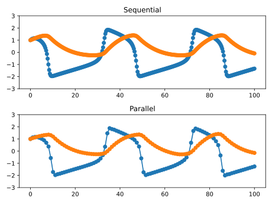

# Parallel-in-time Probabilistic Numerical ODE Solvers

This repo contains the implementation and experiment code for the paper "Parallel-in-Time Probabilistic Numerical ODE Solvers", soon available on arXiv.


## Project environment setup
The project uses [poetry](https://python-poetry.org/).
After installing poetry, you should be able to initialize the project with just
```
poetry install
```


## Usage
```python
import jax
import jax.numpy as jnp
import matplotlib.pyplot as plt

from pof.ivp import fitzhughnagumo
from pof.solver import solve, sequential_eks_solve

ivp = fitzhughnagumo()

ts_par = jnp.linspace(0, 100, 100)
ys_par, info_par = solve(f=ivp.f, y0=ivp.y0, ts=ts_par, order=3, init="constant")

ts_seq = jnp.linspace(0, 100, 300)
ys_seq, info_seq = sequential_eks_solve(f=ivp.f, y0=ivp.y0, ts=ts_seq, order=3)


def plot_result(ts, ys, ax=None):
    means, chol_covs = ys
    covs = jax.vmap(lambda c: c @ c.T, in_axes=0)(chol_covs)

    if ax is None:
        fig, ax = plt.subplots(1, 1)

    ax.plot(ts, means, marker="o")
    for i in range(means.shape[1]):
        ax.fill_between(
            ts,
            means[:, i] - 2 * jnp.sqrt(covs[:, i, i]),
            means[:, i] + 2 * jnp.sqrt(covs[:, i, i]),
            alpha=0.2,
            color=f"C{i}",
        )
    return ax


fig, axes = plt.subplots(2, 1)
plot_result(ts_seq, ys_seq, ax=axes[0])
plot_result(ts_par, ys_par, ax=axes[1])
axes[0].set_ylim(-3, 3)
axes[0].set_title("Sequential")
axes[1].set_ylim(-3, 3)
axes[1].set_title("Parallel")
fig.tight_layout()
plt.show()
```

<p align="center">

</p>


## Testing
Just use [`tox`](https://tox.wiki/en/latest/):
```
tox -e py3
```
Or even just `tox` to also run [`black`](https://github.com/psf/black) and [`isort`](https://pycqa.github.io/isort/).
